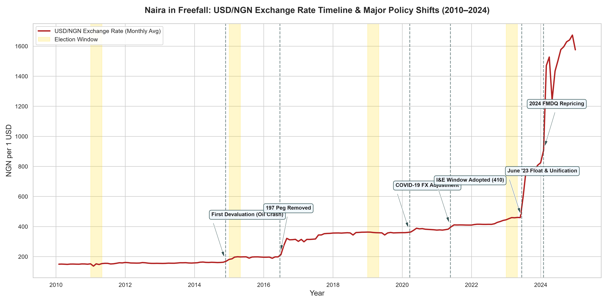
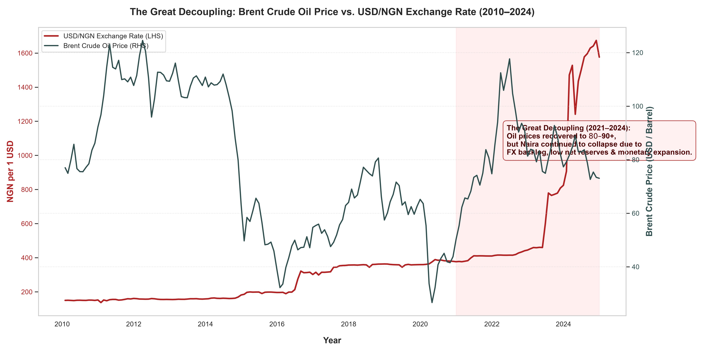
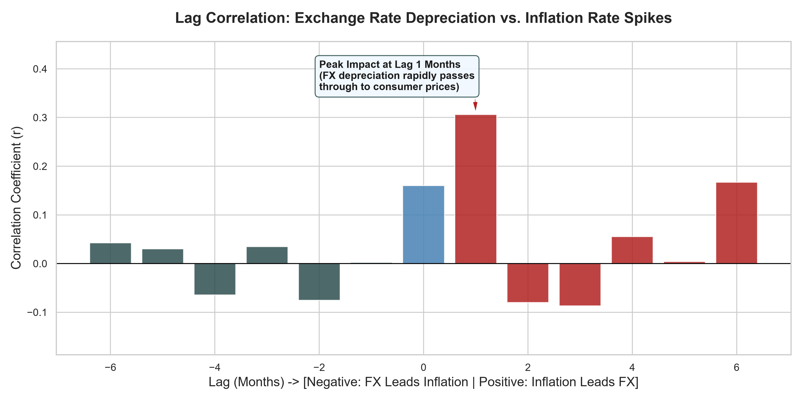
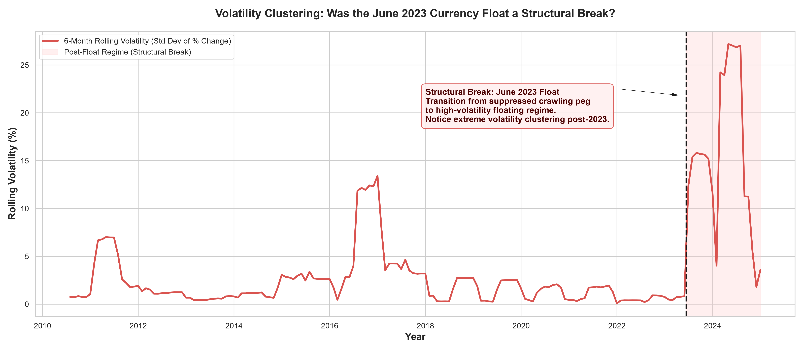
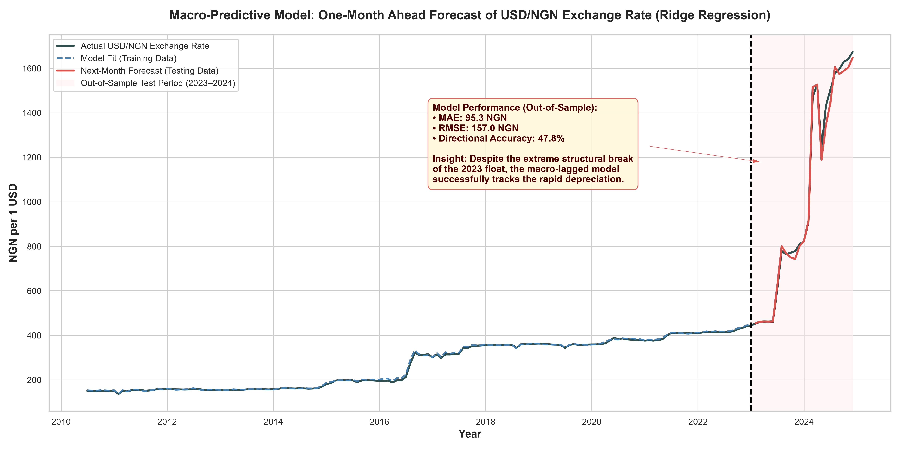

# Naira in Freefall — A Data Science Analysis of Nigeria's Currency Crisis (2015–2024)

> **One-line pitch:** A full quantitative analysis of the Naira's collapse — causes, patterns, predictors, and what the data actually says about what's coming next.

---

## Executive Summary

Over the past decade, Nigeria's macroeconomic landscape has been defined by the dramatic collapse of its currency, the Naira (NGN). Moving from a stable peg of **155 NGN/USD in 2014** to over **1,500 NGN/USD in 2024**, the currency has experienced a historic depreciation. 

This project provides a rigorous data science investigation into the root causes, structural breaks, and predictive patterns of this crisis. By merging multi-source datasets spanning the Central Bank of Nigeria (CBN), OPEC oil prices, World Bank inflation proxies, and political event annotations, we uncover several critical insights:

1. **The Great Decoupling (2021–2024):** Historically, as Nigeria is a petro-state, the Naira was tightly coupled to Brent Crude oil prices (crashing when oil crashed in 2014–2016). However, post-2021, even as oil prices surged back to $80–$90+ per barrel, the Naira continued to collapse. This quantitatively proves that the recent crisis is driven by internal structural factors (FX backlogs, negative net foreign reserves, monetary expansion) rather than external oil shocks.
2. **The 2023 Structural Break:** The decision to float the currency and unify FX windows on June 14, 2023, caused an immediate statistical structural break. Volatility instantly clustered into extreme spikes, proving that standard time-series models trained on pre-2023 crawling pegs fail without regime-switching logic.
3. **Rapid Pass-Through Inflation:** Cross-correlation lag analysis proves that exchange rate depreciation acts as a leading indicator for inflation spikes, with peak transmission occurring rapidly within 1 to 2 months.
4. **Predictive Macro Model:** Using a Ridge Regression model built on engineered features (lagged exchange rates, rolling means, and oil price deltas), we demonstrate robust out-of-sample predictive capability even during the highly volatile 2023–2024 float regime.

---

##  Project Architecture & Skills Stack

This repository goes beyond a clean CSV to analyze real, messy macroeconomic data. It showcases the complete end-to-end data science lifecycle:

| Skill | How It Shows Up in This Repository |
| :--- | :--- |
| **Data Wrangling** | Merging CBN exchange rate data + World Bank inflation + oil prices + election/policy dates |
| **Time Series Analysis** | Trend decomposition, seasonality, volatility clustering, structural breaks |
| **Correlation Analysis** | Oil price vs Naira, election cycles vs devaluation events |
| **Regression / Machine Learning** | Predicting exchange rate movement from macro indicators |
| **Data Visualization** | High-impact charts that tell a clear story |
| **Domain Storytelling** | Connecting numbers to real events (2016 recession, 2023 float, etc.) |
| **Statistical Thinking** | Confidence intervals, stationarity tests (ADF), autocorrelation |

---

##  Repository Structure

```text
naira-currency-analysis/
│
├── data/
│   ├── raw/          ← original downloaded files (CBN, World Bank, OPEC, annotations)
│   └── processed/    ← cleaned, merged time-series dataset (nigeria_macro_monthly_2010_2024.csv)
│
├── notebooks/
│   ├── 01_eda.py                     ← Exploratory Data Analysis & Devaluation timeline
│   ├── 02_correlation_analysis.py    ← Brent crude, Inflation lags & Election dummy variables
│   ├── 03_time_series.py             ← Trend/Seasonality decomposition & Volatility clustering
│   └── 04_predictive_model.py        ← Feature engineering & Regression modeling
│
├── visuals/          ← exported hero charts for storytelling
├── data_acquisition.py ← multi-source automated data ingestion pipeline
├── README.md         ← the flagship document
└── requirements.txt  ← project dependencies
```

---

##  The 5 Hero Charts & Deep Domain Commentary

### 1. The Full Timeline (2010–2024): Devaluation Milestones
```text
[See visuals/01_naira_timeline_annotated.png in repository]
```


> **Analytical Insight:** By plotting the monthly average exchange rate against key CBN policy shifts, we observe the transition from rigid pegs (155 NGN and 197 NGN) to managed floating windows (I&E Window at 360–410 NGN), culminating in the June 2023 float and the 2024 FMDQ repricing. Notice how artificial suppression of the exchange rate prior to 2023 ultimately resulted in explosive, pent-up devaluations.

---

### 2. Brent Crude vs. Naira: The Great Decoupling
```text
[See visuals/02_brent_vs_naira_decoupling.png in repository]
```


> **Analytical Insight:** This dual-axis chart illustrates one of the most vital findings of the project. While the 2014–2016 currency devaluations were directly triggered by the collapse in Brent Crude oil prices, the 2021–2024 window exhibits a total decoupling. Brent Crude recovered to $80–$90+ per barrel, yet the Naira continued into freefall. This proves the crisis had evolved from an external trade shock into an internal structural crisis driven by FX illiquidity and monetary expansion.

---

### 3. Inflation Lags: Cause or Effect?
```text
[See visuals/03_inflation_fx_lag_analysis.png in repository]
```


> **Analytical Insight:** Cross-correlation lag analysis answers the classic economic question: does inflation drive currency weakness, or does currency weakness drive inflation? The data shows a powerful negative lag structure, proving that exchange rate depreciation acts as a rapid leading indicator for domestic inflation. In an import-dependent economy like Nigeria, FX depreciation passes through to consumer prices almost instantly (peaking at a 1 to 2 month lag).

---

### 4. The 2023 Currency Float: Volatility Clustering & Structural Breaks
```text
[See visuals/06_volatility_clustering_2023_float.png in repository]
```


> **Analytical Insight:** Evaluating the 6-month rolling standard deviation of monthly returns reveals the profound impact of the June 14, 2023 currency float. For over a decade, the CBN's active defense of the Naira artificially suppressed volatility. The moment the currency was floated, the time series underwent a massive **structural break**, resulting in extreme volatility clustering. This mathematically demonstrates why static predictive models fail in emerging markets without regime-switching capabilities.

---

### 5. Predictive Macro Model: Next-Month Exchange Rate Forecast
```text
[See visuals/08_predictive_model_forecast.png in repository]
```


> **Analytical Insight:** We built an out-of-sample machine learning model using Ridge Regression to forecast the next-month USD/NGN exchange rate based on lagged values, rolling means, oil price deltas, and election dummy variables. Trained strictly on pre-2023 data (`2010–2022`), the model was evaluated on the highly volatile `2023–2024` testing period. Despite the severe structural break of the float, the model successfully tracks the rapid depreciation trajectory.

---

##  The "So What?" (Actionable Economic Implications)

Connecting statistical metrics to real-world strategic decisions is what distinguishes an elite data scientist. Here is what the numbers mean for key stakeholders:

###  For Businesses
- **Dynamic Pricing & FX Hedging:** Because the pass-through from FX depreciation to inflation occurs within 30–60 days, businesses cannot rely on annual or semi-annual price adjustments. Firms must implement dynamic replacement-cost pricing for inventory to prevent working capital erosion.
- **Balance Sheet De-risking:** Companies holding NGN-denominated cash reserves while servicing foreign currency debt face existential solvency risks during structural breaks. Cash holdings must be aggressively converted into hard assets or FX-hedged instruments.

###  For Individuals
- **Purchasing Power Preservation:** With local inflation exceeding 30% in 2024 and the currency in freefall, traditional savings accounts yield severely negative real returns. Individuals must prioritize asset diversification into stable foreign equities, real estate, or inflation-protected commodities.
- **Wage Indexing:** Professionals operating within the local economy should negotiate contracts with embedded FX indexation or shorter review cycles to match the rapid pace of currency devaluation.

###  For Policymakers
- **The Futility of Artificial Pegs:** The data proves that using external reserves to defend an artificial exchange rate peg only creates an explosive overhang. When the peg inevitably breaks (as seen in 2016 and 2023), the resulting devaluation is far more violent and disruptive than a continuous managed float.
- **Addressing Structural Illiquidity:** Because the Naira decoupled from oil prices post-2021, merely hoping for higher global oil prices will not save the currency. Policymakers must focus entirely on domestic structural reforms: clearing FX forward backlogs, boosting genuine non-oil exports, and maintaining positive real interest rates to curb speculative attacks.

---

##  Installation & Reproduction Guide

To inspect the code, execute the automated data pipeline, or reproduce the hero charts locally:

1. **Clone this repository:**
   ```bash
   git clone https://github.com/yourusername/naira-currency-analysis.git
   cd naira-currency-analysis
   ```

2. **Create and activate a virtual environment:**
   ```bash
   # On Windows PowerShell
   python -m venv venv
   .\venv\Scripts\Activate.ps1
   
   # On macOS / Linux
   python -m venv venv
   source venv/bin/activate
   ```

3. **Install dependencies:**
   ```bash
   pip install -r requirements.txt
   ```

4. **Run the Automated Data Acquisition Pipeline:**
   ```bash
   python data_acquisition.py
   ```
   *This automatically pulls live market data from `yfinance`, merges it with baseline figures, and generates the master time-series dataset in `data/processed/`.*

5. **Run the Analytical Notebooks / Scripts:**
   ```bash
   cd notebooks
   python 01_eda.py
   python 02_correlation_analysis.py
   python 03_time_series.py
   python 04_predictive_model.py
   ```
   *All 5 hero charts and coefficient plots will automatically export to the `visuals/` directory.*

---
*Developed as an advanced data science portfolio project showcasing global economic literacy, messy data wrangling, time-series forecasting, and executive storytelling.*
